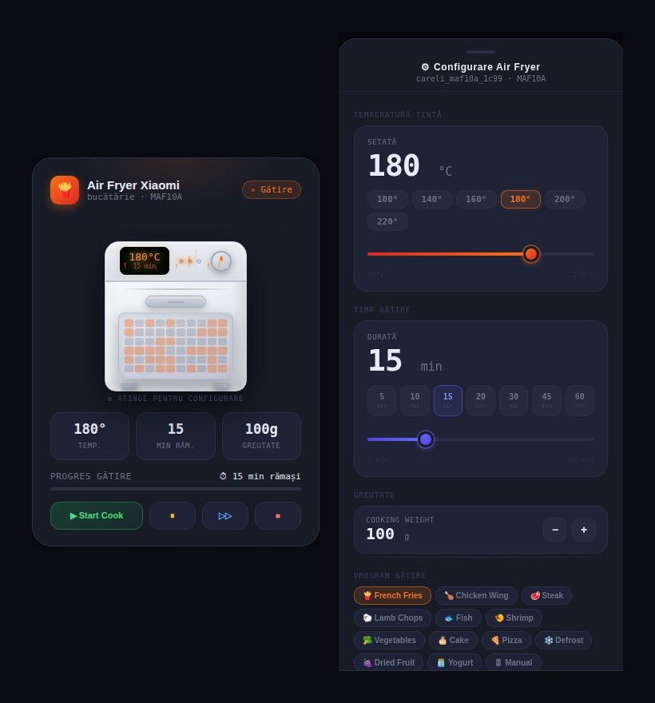

# Xiaomi Air Fryer – Lovelace Card

A custom Home Assistant card for the **Xiaomi Smart Air Fryer MAF10A** (`careli.fryer.maf10a`).



---

## What it does

The card gives you a visual overview of your air fryer at a glance — current temperature, time remaining, cooking status and a live progress bar. Tap the appliance to open a full configuration panel where you can set temperature and time with sliders, pick a cooking program, adjust texture, quantity and all the other settings the device supports.

Everything is wired directly to Home Assistant — no polling, no scripts, no helpers needed.


---

## Installation

### Via HACS (recommended)

1. Open HACS in your Home Assistant sidebar
2. Go to **Frontend**
3. Click the three-dot menu in the top right → **Custom repositories**
4. Add your repository URL and select **Lovelace** as the category
5. Click **Install**
6. Hard refresh your browser (`Ctrl+Shift+R` / `Cmd+Shift+R`)

### Manual

1. Download `xiaomi-airfryer-card.js` and copy it to `/config/www/`
2. In Home Assistant go to **Settings → Dashboards → Resources**
3. Click **Add resource** and fill in:

   | Field | Value |
   |---|---|
   | URL | `/local/xiaomi-airfryer-card.js` |
   | Resource type | JavaScript module |

4. Save and hard refresh your browser

---

## Usage

Add the card to any Lovelace dashboard:

```yaml
type: custom:xiaomi-airfryer-card
device: careli_maf10a_1c99
language: en
```

Replace `careli_maf10a_1c99` with the entity prefix for your device. You can find it by looking at any of the air fryer entities in **Settings → Devices & Services** — it's everything before the last underscore-separated suffix (e.g. `_air_fryer`, `_left_time`, etc.).

---

## Configuration panel

Tap the appliance illustration to open the slide-up panel. From there you can:

- Set **temperature** (40–230 °C) using a slider or quick presets: 100° / 140° / 160° / 180° / 200° / 220°
- Set **cook time** (1–120 min) using a slider or quick presets: 5 / 10 / 15 / 20 / 30 / 45 / 60 min
- Adjust **cooking weight** (100–1800 g)
- Pick a **cooking program**: French Fries, Chicken Wing, Steak, Lamb Chops, Fish, Shrimp, Vegetables, Cake, Pizza, Defrost, Dried Fruit, Yogurt, Manual
- Choose **texture**: None / Crispy Roast / Tender Roast / Degrease
- Set **quantity**: None / One Layer / Double Layer / Half Pot / Full Pot
- Toggle **turn pot reminder**
- Toggle **preheat**, **auto keep warm**, **keep warm**, and **turn pot config**

---

## Entities used

The card auto-discovers all entities based on the `device` prefix you provide:

| Domain | Suffix | Purpose |
|---|---|---|
| `sensor` | `air_fryer` | Cooking status |
| `sensor` | `left_time` | Time remaining |
| `number` | `target_temperature` | Target temperature |
| `number` | `target_time` | Cook time |
| `number` | `cooking_weight` | Food weight |
| `select` | `mode` | Cooking program |
| `select` | `texture` | Texture setting |
| `select` | `target_cooking_measure` | Quantity |
| `select` | `turn_pot` | Turn pot reminder |
| `switch` | `preheat` | Preheat toggle |
| `switch` | `auto_keep_warm` | Auto keep warm |
| `switch` | `current_keep_warm` | Keep warm |
| `switch` | `turn_pot_config` | Turn pot config |
| `button` | `start_cook` | Start cooking |
| `button` | `pause` | Pause |
| `button` | `resume_cook` | Resume |
| `button` | `cancel_cooking` | Stop / cancel |

---

## Compatibility

Tested with:
- Xiaomi Smart Air Fryer MAF10A (`careli.fryer.maf10a`)

Other fryer models may work if their entity structure matches.


